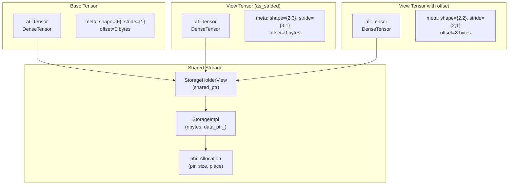

# Paddle compat 层 as_strided 算子与 Storage 机制

本文档结合具体代码，讲解 Paddle compat 层中 `as_strided` 算子如何与 `c10::Storage` 交互，以及 view 张量如何共享底层存储。

> **Note**: 本文档参考 `/home/may/Paddle/paddle/phi/api/include/compat/ATen/ops/as_strided.h` 以及测试代码 `/home/may/Paddle/test/cpp/compat/ATen_as_strided_test.cc` 编写。

---

## 1. as_strided 算子概述

`as_strided` 是 PyTorch 中创建张量 view（视图）的核心算子，它允许用户自定义张量的 shape 和 stride，而无需复制底层数据。在 compat 层中，正确处理 storage 共享对于保证 view 和 base tensor 之间的一致性至关重要。

### 1.1 核心功能

```cpp
// 创建指定 shape 和 stride 的 view，可选 offset
at::Tensor as_strided(at::IntArrayRef size,
                      at::IntArrayRef stride,
                      ::std::optional<int64_t> storage_offset) const;

// Inplace 版本，修改当前 tensor 的 shape/stride
const at::Tensor& as_strided_(at::IntArrayRef size,
                              at::IntArrayRef stride,
                              ::std::optional<int64_t> storage_offset) const;
```

### 1.2 涉及的关键概念

| 概念 | 说明 |
|------|------|
| **View 语义** | `as_strided` 创建的是原张量的视图，共享同一底层 storage |
| **Storage offset** | 指定 view 在 storage 中的起始偏移（元素个数） |
| **Strides** | 定义沿各维度移动时的步长 |
| **Storage 共享** | View 和 base tensor 共享同一个 `StorageImpl`，修改互相可见 |

---

## 2. 源码解析

### 2.1 as_strided 实现

```cpp
// paddle/phi/api/include/compat/ATen/ops/as_strided.h (lines 28-66)

inline at::Tensor Tensor::as_strided(
    at::IntArrayRef size,
    at::IntArrayRef stride,
    ::std::optional<int64_t> storage_offset) const {
  // 关键：先 materialize compat StorageHolderView
  // 这样 alias 张量共享同一个 StorageImpl，后续 resize_ 增长时可见
  (void)this->storage();  // 触发 Storage 同步
  
  auto src_impl = tensor_.impl();
  auto* src_tensor =
      std::dynamic_pointer_cast<phi::DenseTensor>(src_impl).get();
  if (!src_tensor) {
    PD_THROW("as_strided: tensor must be a DenseTensor");
  }
  
  // 创建新 meta 并设置目标 shape 和 strides
  std::vector<int64_t> size_vec(size.begin(), size.end());
  std::vector<int64_t> stride_vec(stride.begin(), stride.end());

  // 创建新的 DenseTensor，但共享数据
  auto new_tensor = std::make_shared<phi::DenseTensor>();
  
  // ShareDataWith 复制 src 的 holder（即 StorageHolderView）
  new_tensor->ShareDataWith(*src_tensor);

  // 创建正确的 meta：新的 shape/strides
  phi::DenseTensorMeta meta(src_tensor->dtype(),
                            common::make_ddim(size_vec),
                            common::make_ddim(stride_vec));
  
  // 计算字节偏移量
  int64_t offset = storage_offset.has_value() ? storage_offset.value() : 0;
  meta.offset = src_tensor->meta().offset +
                static_cast<size_t>(offset) * phi::SizeOf(src_tensor->dtype());
  
  new_tensor->set_meta(meta);
  PaddleTensor result;
  result.set_impl(new_tensor);
  return Tensor(result);
}
```

**关键步骤解析**：

1. **`(void)this->storage()`** - 触发 Storage 同步
   - 这是最关键的一步，确保 `DenseTensor::holder_` 是 `StorageHolderView`
   - 如果 holder 是普通 `phi::Allocation`，会创建新的 `StorageImpl` 和 `StorageHolderView`
   - 保证后续所有 view 都共享同一个 `StorageImpl`

2. **`ShareDataWith(*src_tensor)`** - 共享底层数据
   - 复制 `src_tensor` 的 holder 指针
   - 由于上一步已经确保 holder 是 `StorageHolderView`，所以 view 和 base 共享同一个 `StorageImpl`

3. **设置新的 meta** - 修改 shape/stride/offset
   - 创建新的 `DenseTensorMeta` 指定新的 shape 和 strides
   - 计算字节 offset 并设置到 meta 中

### 2.2 as_strided_ 实现（Inplace 版本）

```cpp
// paddle/phi/api/include/compat/ATen/ops/as_strided.h (lines 69-94)

inline const at::Tensor& Tensor::as_strided_(
    at::IntArrayRef size,
    at::IntArrayRef stride,
    ::std::optional<int64_t> storage_offset) const {
  // 同样先 materialize compat storage
  (void)this->storage();
  
  auto src_impl = tensor_.impl();
  auto* src_tensor =
      std::dynamic_pointer_cast<phi::DenseTensor>(src_impl).get();
  if (!src_tensor) {
    PD_THROW("as_strided_: tensor must be a DenseTensor");
  }
  
  std::vector<int64_t> size_vec(size.begin(), size.end());
  std::vector<int64_t> stride_vec(stride.begin(), stride.end());
  
  // 使用 set_meta 代替 Resize + set_strides，避免 contiguous 检查
  phi::DenseTensorMeta meta(src_tensor->dtype(),
                            common::make_ddim(size_vec),
                            common::make_ddim(stride_vec));
  meta.layout = src_tensor->layout();
  
  int64_t offset = storage_offset.has_value() ? storage_offset.value() : 0;
  meta.offset = src_tensor->meta().offset +
                static_cast<size_t>(offset) * phi::SizeOf(src_tensor->dtype());
  
  src_tensor->set_meta(meta);  // 直接修改原 tensor 的 meta
  return *this;
}
```

**与 non-inplace 版本的区别**：
- 直接修改当前 tensor 的 meta，不创建新 tensor
- 使用 `set_meta` 避免触发 contiguous 检查

### 2.3 as_strided_scatter 实现

```cpp
// paddle/phi/api/include/compat/ATen/ops/as_strided.h (lines 96-111)

inline at::Tensor Tensor::as_strided_scatter(
    const at::Tensor& src,
    at::IntArrayRef size,
    at::IntArrayRef stride,
    ::std::optional<int64_t> storage_offset) const {
  // 克隆 self 为独立副本，确保原 tensor 不被修改
  PaddleTensor self_copy = tensor_.copy_to(tensor_.place(), /*blocking=*/true);
  at::Tensor copy_tensor(self_copy);
  
  // 在副本上创建 strided view
  at::Tensor strided_view =
      copy_tensor.as_strided(size, stride, storage_offset);
  
  // 将 src 的数据拷贝到 view 中
  strided_view.copy_(src);
  
  return strided_view;
}
```

**用途**：将 `src` 张量分散（scatter）到 strided view 中，返回新张量而不修改原张量。

---

## 3. Storage 共享机制详解

### 3.1 架构图



### 3.2 为什么需要 `(void)this->storage()`？

```cpp
// 没有这行代码时可能出现的问题：

// 1. 创建 base tensor
at::Tensor base = at::tensor({1, 2, 3, 4}, at::kInt);
// base 的 holder 可能是普通 phi::Allocation（非 StorageHolderView）

// 2. 直接调用 ShareDataWith 创建 view
// view 的 holder 也是普通 phi::Allocation
// 两者没有共享 StorageImpl！

// 3. 后续通过 storage() 修改 storage 数据
base.storage().set_data_ptr_noswap(new_alloc);
// view 无法看到这个修改，因为它们没有共享 StorageImpl
```

**加上 `(void)this->storage()` 后**：

```cpp
// 1. 调用 storage() 触发 SyncStorageFromTensor()
//    - 创建 StorageImpl
//    - 创建 StorageHolderView
//    - 替换 DenseTensor::holder_ 为 StorageHolderView

// 2. ShareDataWith 复制 StorageHolderView
//    - view 和 base 共享同一个 StorageImpl

// 3. 后续 storage 修改对两者都可见
```

---

## 4. 测试代码解读

### 4.1 基本 as_strided 测试

```cpp
// test/cpp/compat/ATen_as_strided_test.cc (lines 34-44)
TEST_F(TensorAsStridedTest, AsStridedBasic) {
  // shape {2,3}, stride {3,1}: 表示 2x3 矩阵
  // [[0,1,2],[3,4,5]]
  at::Tensor t = at::arange(12, at::kFloat);
  at::Tensor result = t.as_strided({2, 3}, {3, 1});

  ASSERT_EQ(result.sizes(), c10::IntArrayRef({2, 3}));
  float* data = result.data_ptr<float>();
  ASSERT_FLOAT_EQ(data[0], 0.0f);
  ASSERT_FLOAT_EQ(data[1], 1.0f);
  ASSERT_FLOAT_EQ(data[5], 5.0f);
}
```

**说明**：
- `arange(12)` 创建 `[0, 1, 2, ..., 11]` 的一维张量
- `as_strided({2, 3}, {3, 1})` 将其视为 2x3 矩阵
- 访问 `result[i][j]` 实际访问 `t[i*3 + j]`

### 4.2 带 offset 的 as_strided

```cpp
// test/cpp/compat/ATen_as_strided_test.cc (lines 46-54)
TEST_F(TensorAsStridedTest, AsStridedWithOffset) {
  // offset=2: 从索引 2 开始，[[2,3,4],[5,6,7]]
  at::Tensor t = at::arange(12, at::kFloat);
  at::Tensor result = t.as_strided({2, 3}, {3, 1}, 2);

  ASSERT_EQ(result.sizes(), c10::IntArrayRef({2, 3}));
  float* data = result.data_ptr<float>();
  ASSERT_FLOAT_EQ(data[5], 7.0f);  // 偏移 2 后，第 6 个元素是 7
}
```

### 4.3 View 修改影响原张量

```cpp
// test/cpp/compat/ATen_as_strided_test.cc (lines 97-104)
TEST_F(TensorAsStridedTest, AsStridedInplaceModifiesView) {
  // 修改 view，验证原张量也受影响
  at::Tensor t = at::arange(12, at::kFloat);
  at::Tensor view = t.as_strided({2, 3}, {3, 1});

  view.data_ptr<float>()[0] = 99.0f;
  
  // view 和 t 共享 storage，所以修改 view 会影响 t
  ASSERT_FLOAT_EQ(t.data_ptr<float>()[0], 99.0f);
}
```

**Storage 共享验证**：

```cpp
// test/cpp/compat/c10_storage_test.cc (lines 982-993)
TEST(StorageTest, AsStridedViewSharesStorageImplWithBaseTensor) {
  at::Tensor base = at::tensor({1, 2, 3, 4}, at::kInt);
  at::Tensor view = base.as_strided({3}, {1}, 1);

  // view 和 base 共享同一个 StorageImpl
  ASSERT_EQ(base.storage().get_impl(), view.storage().get_impl());

  // 对 view 执行 resize_ 会更新共享的 compat storage
  view.resize_({4});

  // 从 base tensor 可以看到 resize_ 的效果
  ASSERT_EQ(view.data_ptr<int>(), base.data_ptr<int>() + 1);
}
```

---

## 5. 关键 API 使用示例

### 5.1 创建 Strided View

```cpp
#include <ATen/Functions.h>

// 创建基础张量
at::Tensor base = at::arange(12, at::kFloat);  // [0, 1, 2, ..., 11]

// 创建 2x3 的 view
at::Tensor view = base.as_strided({2, 3}, {3, 1});
// view 可视作:
// [[0, 1, 2],
//  [3, 4, 5]]

// 创建带 offset 的 view
at::Tensor view_offset = base.as_strided({2, 3}, {3, 1}, 2);
// 从索引 2 开始:
// [[2, 3, 4],
//  [5, 6, 7]]
```

### 5.2 转置效果

```cpp
at::Tensor t = at::arange(6, at::kFloat).view({2, 3});
// [[0, 1, 2],
//  [3, 4, 5]]

// 使用 as_strided 实现转置
at::Tensor transposed = t.as_strided({3, 2}, {1, 3});
// [[0, 3],
//  [1, 4],
//  [2, 5]]
```

### 5.3 检查 Storage 共享

```cpp
at::Tensor base = at::arange(12, at::kFloat);
at::Tensor view = base.as_strided({2, 3}, {3, 1});

// 检查是否共享 storage
bool shares_storage = base.is_alias_of(view);  // true

// 获取 storage 并验证
auto base_storage = base.storage();
auto view_storage = view.storage();

// 两者指向同一个 StorageImpl
assert(base_storage.get_impl() == view_storage.get_impl());

// use_count 包含 base 和 view 各自的引用
std::cout << "Storage use_count: " << base_storage.use_count() << std::endl;
```

---

## 6. 注意事项

1. **必须先调用 `storage()`**：在 `as_strided` 开头调用 `(void)this->storage()` 是必须的，它确保后续 `ShareDataWith` 能正确共享 `StorageImpl`。

2. **View 和 Base 的生命周期**：View 不拥有底层数据，如果 base tensor 被释放，view 访问数据将是未定义行为。

3. **Offset 计算**：`storage_offset` 参数以元素个数为单位，内部会乘以元素大小转换为字节偏移。

4. **Resize 行为**：对 view 执行 `resize_` 会影响共享的 storage。如果 view 有非零 offset，resize 后的数据指针会从 storage 起始位置 + offset 开始。

5. **非连续张量**：`as_strided` 可以创建非连续（non-contiguous）张量，这在某些操作（如转置）中很常见。

---

## 7. 参考代码路径

| 文件 | 说明 |
|------|------|
| `/home/may/Paddle/paddle/phi/api/include/compat/ATen/ops/as_strided.h` | as_strided/as_strided_/as_strided_scatter 实现 |
| `/home/may/Paddle/test/cpp/compat/ATen_as_strided_test.cc` | as_strided 功能测试 |
| `/home/may/Paddle/test/cpp/compat/c10_storage_test.cc` | Storage 共享相关测试 |
