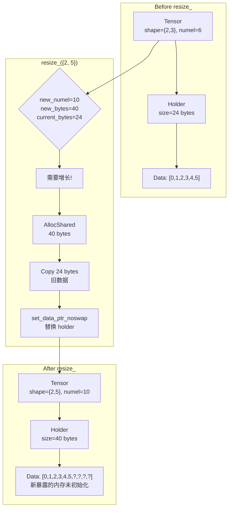

# Paddle compat 层 resize_ 算子与 Storage 机制

本文档结合具体代码，讲解 Paddle compat 层中 `resize_` 算子如何与 `c10::Storage` 交互，以及如何在调整大小时保持 storage 语义。

> **Note**: 本文档参考 `/home/may/Paddle/paddle/phi/api/include/compat/ATen/ops/resize.h` 以及测试代码 `/home/may/Paddle/test/cpp/compat/ATen_resize_test.cc` 编写。

---

## 1. resize_ 算子概述

`resize_` 是 PyTorch 中用于原地调整张量大小的核心算子。与 `view` 或 `reshape` 不同，`resize_` 可以增长或缩减底层 storage，并在需要时重新分配内存。

### 1.1 核心功能

```cpp
// 原地调整张量大小，返回自身引用
const at::Tensor& resize_(at::IntArrayRef size,
                          ::std::optional<at::MemoryFormat> memory_format) const;
```

### 1.2 涉及的关键概念

| 概念 | 说明 |
|------|------|
| **原地操作** | `resize_` 修改当前 tensor，不创建新 tensor |
| **Storage 增长** | 当新大小超过当前 capacity 时，分配更大的 storage 并复制数据 |
| **Storage 缩减** | 当新大小小于当前 capacity 时，仅修改 shape，不释放内存 |
| **数据保留** | 增长/缩减时保留已有数据，新暴露的内存未初始化 |

---

## 2. 源码解析

### 2.1 resize_ 完整实现

```cpp
// paddle/phi/api/include/compat/ATen/ops/resize.h (lines 71-117)

inline const at::Tensor& Tensor::resize_(
    at::IntArrayRef size,
    ::std::optional<at::MemoryFormat> memory_format) const {
  // 暂时忽略 memory_format，后续 PR 添加 ChannelsLast 支持
  (void)memory_format;

  std::vector<int64_t> dims(size.begin(), size.end());
  int64_t new_numel = detail::ResizeCheckedNumel(size);  // 计算新的元素个数
  
  auto dense_tensor =
      std::dynamic_pointer_cast<phi::DenseTensor>(tensor_.impl());
  TORCH_CHECK(dense_tensor != nullptr,
              "resize_ only supports DenseTensor");
  TORCH_CHECK(tensor_.defined(),
              "resize_ is not allowed on an undefined tensor");

  const size_t itemsize = phi::SizeOf(dense_tensor->dtype());
  const size_t new_storage_bytes = detail::ResizeCheckedStorageBytes(
      new_numel, itemsize, dense_tensor->meta().offset);
  const size_t current_storage_bytes =
      dense_tensor->Holder() == nullptr ? 0 : dense_tensor->Holder()->size();

  // 情况1：新大小 <= 当前 capacity，直接 Resize
  if (new_storage_bytes <= current_storage_bytes || new_numel == 0) {
    dense_tensor->Resize(dims);
    return *this;
  }

  // 情况2：需要增长 storage
  // 先通过 storage() 确保 holder 是 StorageHolderView
  auto storage = this->storage();
  const auto old_holder = dense_tensor->Holder();
  TORCH_CHECK(old_holder != nullptr,
              "resize_ cannot grow a tensor without allocated storage");
  
  const phi::Place place = old_holder->place();
  
  // 分配新的更大的 storage
  auto new_holder = paddle::memory::AllocShared(place, new_storage_bytes);
  TORCH_CHECK(new_holder != nullptr, "resize_ failed to allocate storage");
  
  // 复制旧数据到新 storage
  const size_t copy_bytes = std::min(old_holder->size(), new_storage_bytes);
  if (copy_bytes > 0 && old_holder->ptr() != nullptr &&
      old_holder->ptr() != new_holder->ptr()) {
    phi::memory_utils::Copy(
        place, new_holder->ptr(), place, old_holder->ptr(), copy_bytes);
  }
  
  // 关键：通过 storage API 替换底层 holder
  storage.set_data_ptr_noswap(std::move(new_holder));
  dense_tensor->Resize(phi::make_ddim(dims));
  return *this;
}
```

**关键步骤解析**：

1. **计算新大小** - `ResizeCheckedNumel` 和 `ResizeCheckedStorageBytes`
   - 验证 size 没有负数维度
   - 验证元素个数不会溢出
   - 考虑 tensor 的 offset，计算所需总字节数

2. **判断是否需要重新分配**
   - 如果 `new_storage_bytes <= current_storage_bytes`，直接 `Resize`
   - 如果 tensor 为空 (`numel == 0`)，也直接 `Resize`

3. **增长 storage 时的关键操作**
   - 调用 `this->storage()` 确保 holder 是 `StorageHolderView`
   - 分配新的 `phi::Allocation`
   - 使用 `storage.set_data_ptr_noswap(new_holder)` 替换底层数据
   - 由于所有 view 共享同一个 `StorageImpl`，它们都能看到新数据

### 2.2 ResizeCheckedNumel - 安全计算元素个数

```cpp
// paddle/phi/api/include/compat/ATen/ops/resize.h (lines 33-51)

inline int64_t ResizeCheckedNumel(at::IntArrayRef size) {
  int64_t numel = 1;
  for (const auto dim : size) {
    TORCH_CHECK(dim >= 0,
                "Trying to create tensor with negative dimension ",
                dim, ": ", size);
    if (dim == 0) {
      numel = 0;
      continue;
    }
    // 检查乘法溢出
    TORCH_CHECK(numel <= std::numeric_limits<int64_t>::max() / dim,
                "resize_ size is too large, possible overflow for size ",
                size);
    numel *= dim;
  }
  return numel;
}
```

### 2.3 ResizeCheckedStorageBytes - 安全计算存储字节数

```cpp
// paddle/phi/api/include/compat/ATen/ops/resize.h (lines 53-63)

inline size_t ResizeCheckedStorageBytes(int64_t numel,
                                        size_t itemsize,
                                        size_t storage_offset_bytes) {
  const auto numel_size = static_cast<size_t>(numel);
  TORCH_CHECK(
      itemsize == 0 || numel_size <= (std::numeric_limits<size_t>::max() -
                                      storage_offset_bytes) /
                                         itemsize,
      "resize_ size is too large in bytes");
  return storage_offset_bytes + numel_size * itemsize;
}
```

**注意**：这里考虑了 `storage_offset_bytes`，即 tensor 在 storage 中的偏移。resize 需要为 offset + data 分配足够的空间。

---

## 3. Storage 增长机制详解

### 3.1 增长流程图



### 3.2 为什么使用 `storage.set_data_ptr_noswap()`？

```cpp
// 关键代码行
storage.set_data_ptr_noswap(std::move(new_holder));
```

**原因**：
1. **共享更新** - 由于 storage 可能被多个 tensor/view 共享，通过 `set_data_ptr_noswap` 更新 `StorageImpl` 中的数据，所有共享者都能看到新数据
2. **保持 StorageImpl** - 不创建新的 `StorageImpl`，只是替换内部的 `data_allocation_`
3. **view 一致性** - 如果 tensor 有 view（如 `as_strided` 创建的），view 会跟随 base tensor 的新 storage

### 3.3 View 的 resize_ 行为

当 view（如 `as_strided` 创建的）执行 `resize_` 时：

```cpp
// 创建 base tensor
at::Tensor ta = at::tensor({1, 2, 3, 4}, at::kInt);
// ta 的 storage: [1, 2, 3, 4]

// 创建带 offset 的 view
at::Tensor tb = ta.as_strided({3}, {1}, 1);
// tb 的 offset = 1，指向 storage[1]
// tb 当前可视作: [2, 3, 4]

// 对 view 执行 resize_
tb.resize_(4);
```

**结果**：
- `resize_` 会为 storage 分配新空间（因为 4 个 int > 当前 capacity）
- 旧数据被复制到新 storage
- `tb` 仍然指向 offset=1 的位置
- `tb.data_ptr()` = `ta.data_ptr() + 1`（仍然共享 storage）

```cpp
// test/cpp/compat/ATen_resize_test.cc (lines 264-288)
TEST(TensorResizeTest, ResizeSliceSharedStorageCopiesFromStorageStart) {
  at::Tensor ta = at::tensor({1, 2, 3, 4}, at::kInt);
  at::Tensor tb = ta.as_strided({3}, {1}, 1);

  tb.resize_(4);

  // resize 后 tb 仍与 ta 共享 storage，offset 保持为 1
  ASSERT_EQ(tb.data_ptr<int>(), ta.data_ptr<int>() + 1);
  
  // ta 的数据保持不变
  ASSERT_EQ(ta[0].item<int>(), 1);
  ASSERT_EQ(ta[1].item<int>(), 2);
  ASSERT_EQ(ta[2].item<int>(), 3);
  ASSERT_EQ(ta[3].item<int>(), 4);
  
  // tb 的前 3 个元素是原数据
  ASSERT_EQ(tb[0].item<int>(), 2);
  ASSERT_EQ(tb[1].item<int>(), 3);
  ASSERT_EQ(tb[2].item<int>(), 4);
}
```

---

## 4. 测试代码解读

### 4.1 基本 resize 测试

```cpp
// test/cpp/compat/ATen_resize_test.cc (lines 35-45)
TEST(TensorResizeTest, ResizeBasic) {
  at::Tensor t = at::arange(6, at::kFloat).reshape({2, 3});

  // 从 2x3 resize 到 3x2（元素个数相同）
  t.resize_({3, 2});

  ASSERT_EQ(t.sizes()[0], 3);
  ASSERT_EQ(t.sizes()[1], 2);
}
```

### 4.2 数据保留测试

```cpp
// test/cpp/compat/ATen_resize_test.cc (lines 100-115)
TEST(TensorResizeTest, ResizePreservesData) {
  at::Tensor t = at::arange(6, at::kFloat).reshape({2, 3});

  // Resize 到 3x2
  t.resize_({3, 2});

  // 验证数据按行优先顺序保留
  float* data = t.data_ptr<float>();
  ASSERT_FLOAT_EQ(data[0], 0.0f);
  ASSERT_FLOAT_EQ(data[1], 1.0f);
  ASSERT_FLOAT_EQ(data[2], 2.0f);
  ASSERT_FLOAT_EQ(data[3], 3.0f);
  ASSERT_FLOAT_EQ(data[4], 4.0f);
  ASSERT_FLOAT_EQ(data[5], 5.0f);
}
```

### 4.3 缩容和扩容往返测试

```cpp
// test/cpp/compat/ATen_resize_test.cc (lines 145-159)
TEST(TensorResizeTest, ResizeShrinkGrowRoundTripPreservesTail) {
  at::Tensor t = at::arange(24, at::kFloat).reshape({2, 3, 4});

  // 先缩容
  t.resize_({4, 5});  // 20 elements
  // 再扩容回原大小
  t.resize_({2, 3, 4});  // 24 elements

  // 验证所有数据都被保留
  float* data = t.data_ptr<float>();
  for (int i = 0; i < 24; ++i) {
    ASSERT_FLOAT_EQ(data[i], static_cast<float>(i));
  }
}
```

### 4.4 扩容保留前缀数据

```cpp
// test/cpp/compat/ATen_resize_test.cc (lines 131-143)
TEST(TensorResizeTest, ResizeGrowDifferentNumelPreservesPrefix) {
  at::Tensor t = at::arange(6, at::kFloat).reshape({2, 3});

  // 从 6 个元素扩容到 10 个元素
  t.resize_({2, 5});

  ASSERT_EQ(t.sizes()[0], 2);
  ASSERT_EQ(t.sizes()[1], 5);

  // 前 6 个元素保留原值
  float* data = t.data_ptr<float>();
  for (int i = 0; i < 6; ++i) {
    ASSERT_FLOAT_EQ(data[i], static_cast<float>(i));
  }
  // 新暴露的元素 (data[6..9]) 未初始化，不应断言
}
```

### 4.5 错误处理测试

```cpp
// test/cpp/compat/ATen_resize_test.cc (lines 189-194)
TEST(TensorResizeTest, ResizeRejectsNegativeDimension) {
  at::Tensor t = at::arange(6, at::kFloat);
  auto bad_size = std::vector<int64_t>{2, -1};

  EXPECT_THROW(t.resize_(bad_size), std::exception);
}

// test/cpp/compat/ATen_resize_test.cc (lines 196-201)
TEST(TensorResizeTest, ResizeRejectsNumelOverflow) {
  at::Tensor t = at::arange(1, at::kFloat);
  auto huge_size = std::vector<int64_t>{std::numeric_limits<int64_t>::max(), 2};

  EXPECT_THROW(t.resize_(huge_size), std::exception);
}
```

---

## 5. 关键 API 使用示例

### 5.1 基本 resize

```cpp
#include <ATen/Functions.h>

at::Tensor t = at::arange(6, at::kFloat).reshape({2, 3});
// t: [[0, 1, 2],
//     [3, 4, 5]]

// 改变形状（元素个数不变）
t.resize_({3, 2});
// t: [[0, 1],
//     [2, 3],
//     [4, 5]]

// 扩容（需要重新分配）
t.resize_({2, 5});
// t: [[0, 1, 2, 3, 4],
//     [5, ?, ?, ?, ?]]  // ? 是未初始化内存
```

### 5.2 配合 View 使用

```cpp
at::Tensor base = at::arange(12, at::kFloat);
at::Tensor view = base.as_strided({3}, {1}, 2);  // [2, 3, 4]

// 对 view 执行 resize_
view.resize_({5});

// base 也被影响，因为 storage 被替换
// view 仍然指向 base.data_ptr() + 2
```

### 5.3 检查 storage 变化

```cpp
at::Tensor t = at::arange(6, at::kFloat);
auto storage = t.storage();
auto old_data = storage.data();

// 缩容（不重新分配）
t.resize_({2, 2});
assert(storage.data() == old_data);  // 数据指针不变

// 扩容（重新分配）
t.resize_({10, 10});  // 100 elements
auto new_data = storage.data();
assert(new_data != old_data);  // 数据指针改变
```

---

## 6. 与 PyTorch resize_ 的对比

| 特性 | PyTorch | Paddle compat |
|------|---------|---------------|
| 原地操作 | ✅ | ✅ |
| Storage 共享 | ✅ | ✅（通过 `StorageHolderView`） |
| 增长时复制数据 | ✅ | ✅ |
| 缩减时不释放 | ✅ | ✅ |
| 处理 view | ✅ | ✅（保持 offset） |
| memory_format | 支持 | 暂时忽略（TODO） |
| 溢出检查 | ✅ | ✅ |

---

## 7. 注意事项

1. **必须调用 `storage()` 后再 `set_data_ptr_noswap`**：在增长 storage 前，必须先调用 `this->storage()` 确保 holder 是 `StorageHolderView`，这样后续替换才会通过 `StorageImpl` 传播给所有 view。

2. **数据保留但不初始化新内存**：扩容时，旧数据被复制，但新暴露的内存是未初始化的（包含垃圾值）。

3. **View 的 offset 保持不变**：对带 offset 的 view 执行 `resize_`，view 仍然指向 storage 的 offset 位置。

4. **返回值是引用**：`resize_` 返回 `const at::Tensor&`，即返回自身引用，支持链式调用。

5. **零元素张量特殊处理**：`numel == 0` 时不检查 capacity，直接 `Resize`。

6. **TODO - MemoryFormat**：当前实现忽略 `memory_format` 参数，后续需要添加 `ChannelsLast` 等布局支持。

---

## 8. 参考代码路径

| 文件 | 说明 |
|------|------|
| `/home/may/Paddle/paddle/phi/api/include/compat/ATen/ops/resize.h` | resize_ 实现及辅助函数 |
| `/home/may/Paddle/test/cpp/compat/ATen_resize_test.cc` | resize_ 功能完整测试 |
| `/home/may/Paddle/test/cpp/compat/c10_storage_test.cc` | Storage 共享相关测试（含 view resize） |
