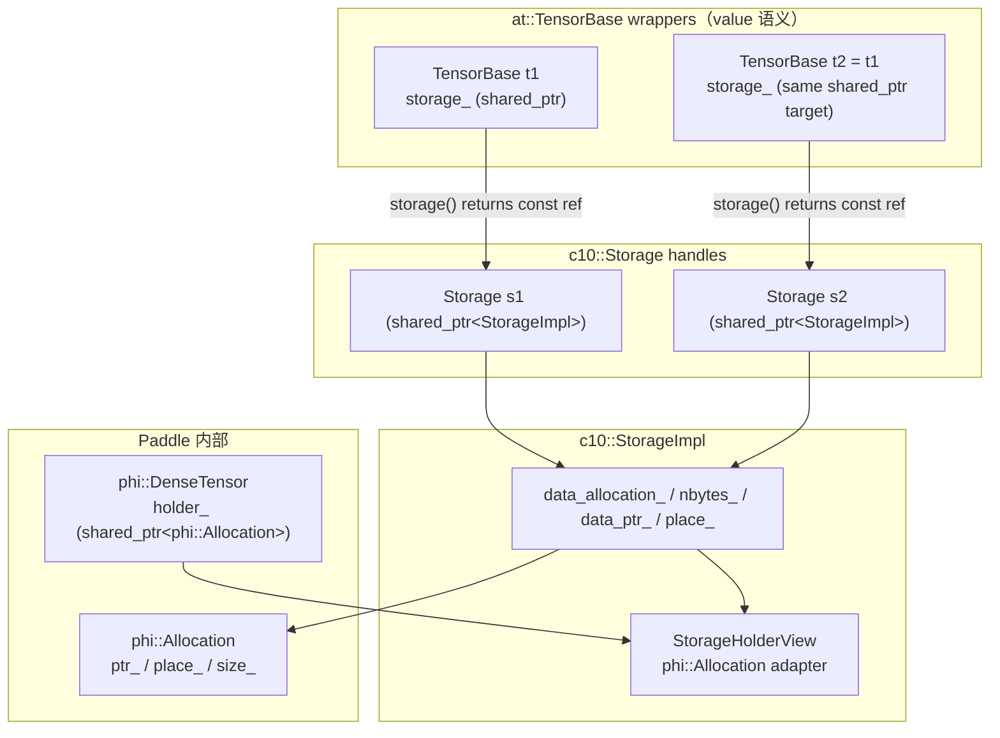
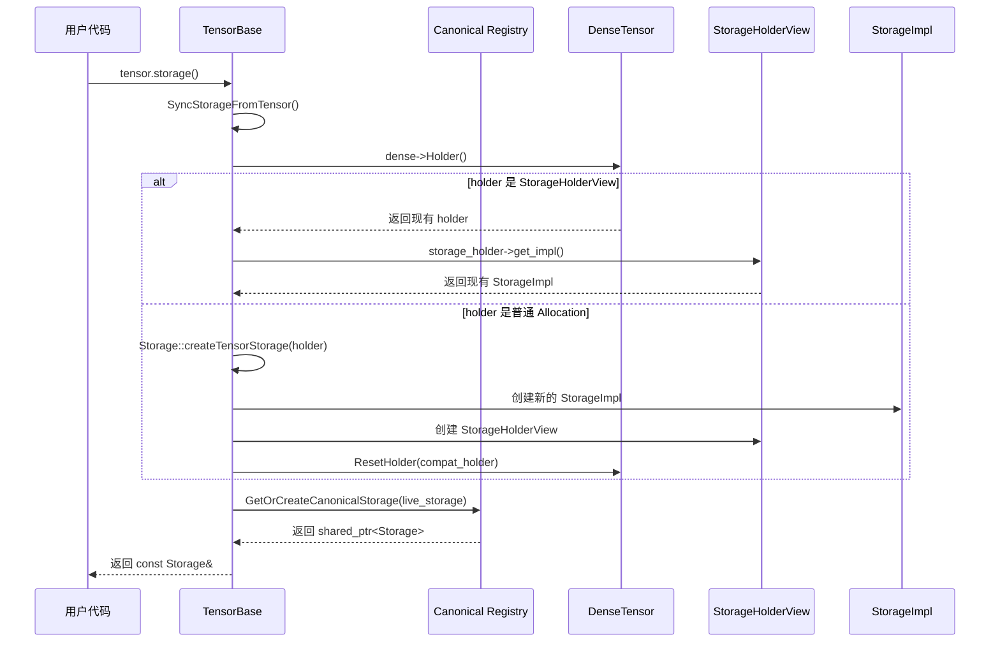

# Paddle compat 层 Storage 机制学习文档

本文档结合具体代码，一步步讲解 Paddle compat 层中 `c10::Storage` / `c10::DataPtr` 的架构设计与实现原理。

> **Note**: 本文档参考 `/home/may/PaddleCppAPITest/doc/c10/core/storage_compat_arch.md` 以及 Paddle 测试代码 `/home/may/Paddle/test/cpp/compat/c10_storage_test.cc` 编写。

---

## 1. 整体架构概览

Paddle compat 层的目标是让 PyTorch 的 C++ API (`ATen`, `c10`) 能够在 PaddlePaddle 后端上运行。其中 `c10::Storage` 是管理张量底层内存存储的核心抽象。

### 1.1 核心组件关系图



### 1.2 关键设计原则

| 设计点 | 说明 |
|--------|------|
| **共享 StorageImpl** | 多个 `c10::Storage` 句柄通过 `shared_ptr<StorageImpl>` 共享同一底层状态 |
| **引用语义** | 通过任一句柄的写操作（`set_data_ptr*`、`set_nbytes`）对所有句柄可见 |
| **Lazy Storage 创建** | `TensorBase::storage()` 首次调用时才从 `phi::DenseTensor` 同步创建 |
| **Canonical Storage 缓存** | 按 `StorageImpl*` 归一的弱引用注册表，避免重复创建 Storage 对象 |

---

## 2. 核心组件详解

### 2.1 StorageImpl - 共享状态容器

`StorageImpl` 是所有 Storage 句柄共享的内部状态：

```cpp
// paddle/phi/api/include/compat/c10/core/Storage.h (lines 44-55)
struct StorageImpl {
  std::shared_ptr<phi::Allocation> data_allocation_;  // Paddle Allocation 包装
  phi::Allocator* allocator_ = nullptr;               // 可选分配器
  size_t nbytes_ = 0;                                 // 字节数
  bool resizable_ = false;                            // 是否可调整大小
  phi::Place place_;                                  // 设备位置
  DataPtr data_ptr_;                                  // DataPtr 直接成员（非 owning view 或外部数据）
  std::weak_ptr<StorageHolderView> tensor_holder_;    // 弱引用回指 tensor holder
};
```

**关键点**：
- `data_allocation_` 和 `data_ptr_` 是两种数据持有方式：
  - **Allocation-backed**: 来自 Paddle 内部，通过 `phi::Allocation` 管理
  - **External DataPtr**: 来自外部，带有自定义 deleter

### 2.2 StorageHolderView - 桥接 Paddle 与 compat 层

`StorageHolderView` 继承自 `phi::Allocation`，作为 `DenseTensor::holder_` 的兼容包装：

```cpp
// paddle/phi/api/include/compat/c10/core/Storage.h (lines 57-83)
class StorageHolderView final : public phi::Allocation {
 public:
  explicit StorageHolderView(std::shared_ptr<StorageImpl> impl)
      : impl_(std::move(impl)) {}

  std::shared_ptr<StorageImpl> get_impl() const { return impl_; }

  void* ptr() const noexcept override {
    if (!impl_) return nullptr;
    if (impl_->data_allocation_) {
      return impl_->data_allocation_->ptr();  // Allocation-backed 路径
    }
    return impl_->data_ptr_.get();            // External DataPtr 路径
  }

  size_t size() const noexcept override { return impl_ ? impl_->nbytes_ : 0; }

  const Place& place() const noexcept override {
    return impl_ ? impl_->place_ : place_;
  }

 private:
  std::shared_ptr<StorageImpl> impl_;
  Place place_;
};
```

**工作流程**：
1. 首次调用 `tensor.storage()` 时，创建 `StorageImpl` 和 `StorageHolderView`
2. `StorageHolderView` 被设置到 `DenseTensor::holder_` 上
3. 后续调用通过 `holder_` 恢复同一个 `StorageImpl`

### 2.3 Storage - 用户可见的句柄

`Storage` 是用户直接交互的句柄类，内部通过 `shared_ptr<StorageImpl>` 共享状态：

```cpp
// paddle/phi/api/include/compat/c10/core/Storage.h (lines 85-118)
struct Storage {
 public:
  struct use_byte_size_t {};
  struct unsafe_borrow_t { unsafe_borrow_t() = default; };

  // 默认构造：空 storage
  Storage() : impl_(std::make_shared<StorageImpl>()) {}

  // 拷贝构造：共享 StorageImpl（关键！）
  Storage(const Storage& other) : impl_(other.impl_) {}

  // 移动构造：转移所有权
  Storage(Storage&& other) noexcept : impl_(std::move(other.impl_)) {}

  // 从 phi::Allocation 构造（Paddle 内部路径）
  Storage(std::shared_ptr<phi::Allocation> alloc,
          std::unique_ptr<phi::StorageProperties> props = nullptr) {
    impl_ = std::make_shared<StorageImpl>();
    if (alloc) {
      syncFromAllocation(std::move(alloc));
    }
  }

  // LibTorch 兼容构造：预分配 DataPtr
  Storage(use_byte_size_t /*use_byte_size*/,
          size_t size_bytes,
          DataPtr data_ptr,
          phi::Allocator* allocator = nullptr,
          bool resizable = false) {
    impl_ = std::make_shared<StorageImpl>();
    impl_->allocator_ = allocator;
    impl_->nbytes_ = size_bytes;
    impl_->resizable_ = resizable;
    syncFromDataPtr(std::move(data_ptr), size_bytes);
  }

  // ... 更多方法

 private:
  std::shared_ptr<StorageImpl> impl_;  // 共享状态
};
```

---

## 3. TensorBase::storage() 实现机制

### 3.1 源码解析

```cpp
// paddle/phi/api/include/compat/ATen/core/TensorBase.h (lines 399-475)

// 返回 const 引用，避免不必要的拷贝
const c10::Storage& storage() const {
  SyncStorageFromTensor();
  static const c10::Storage kEmptyStorage;
  return storage_ ? *storage_ : kEmptyStorage;
}

// 检查是否有有效 storage
bool has_storage() const {
  SyncStorageFromTensor();
  return tensor_.defined() && storage_ && storage_->valid();
}

private:
  // 关键：静态注册表，按 StorageImpl* 复用 Storage 对象
  static std::shared_ptr<c10::Storage> GetOrCreateCanonicalStorage(
      c10::Storage&& live_storage) {
    auto impl = live_storage.get_impl();
    if (!impl) {
      return std::make_shared<c10::Storage>(std::move(live_storage));
    }

    static std::mutex registry_mu;
    static std::unordered_map<c10::StorageImpl*, std::weak_ptr<c10::Storage>>
        registry;

    std::lock_guard<std::mutex> guard(registry_mu);
    auto it = registry.find(impl.get());
    if (it != registry.end()) {
      if (auto cached = it->second.lock()) {
        return cached;  // 复用已存在的 Storage
      }
      registry.erase(it);
    }

    auto created = std::make_shared<c10::Storage>(std::move(live_storage));
    registry.emplace(impl.get(), created);
    return created;
  }

  // 从 DenseTensor 同步 Storage 状态
  void SyncStorageFromTensor() const {
    auto dense = std::dynamic_pointer_cast<phi::DenseTensor>(tensor_.impl());
    if (!dense) {
      storage_.reset();
      return;
    }

    auto holder = dense->Holder();
    if (!holder) {
      storage_.reset();
      return;
    }

    // 从 holder 创建（或复用）Storage
    c10::Storage live_storage = c10::Storage::createTensorStorage(holder);
    auto compat_holder = live_storage.ensureTensorHolder();
    if (holder != compat_holder) {
      // 需要替换 DenseTensor 的 holder 为 StorageHolderView
      MaybeResetHolder(dense.get(), compat_holder, 0);
    }

    // 使用 canonical storage（避免多个 wrapper 创建多个 Storage 对象）
    if (!storage_ || storage_->get_impl() != live_storage.get_impl()) {
      storage_ = GetOrCreateCanonicalStorage(std::move(live_storage));
    }
  }

  mutable std::shared_ptr<c10::Storage> storage_;  // 缓存的 canonical Storage
```

### 3.2 流程图解



---

## 4. 测试代码解读

### 4.1 use_count 语义测试

```cpp
// test/cpp/compat/c10_storage_test.cc (lines 116-125)
TEST(StorageTest, StorageUseCountIncludesTensorRef) {
  at::TensorBase tensor = at::ones({2, 3}, at::kFloat);
  c10::Storage storage = tensor.storage();

  // tensor.storage_ contributes 1, `storage` contributes 1.
  ASSERT_EQ(storage.use_count(), 2)
      << "use_count() must include the tensor's own StorageImpl reference";
  ASSERT_FALSE(storage.unique())
      << "unique() must be false because tensor also holds a reference";
}
```

**说明**：
- `use_count()` 返回共享 `StorageImpl` 的 `Storage` 句柄数量
- `TensorBase` 内部持有 `shared_ptr<Storage>`，所以至少为 1
- 当显式拷贝 `Storage` 时，计数会增加

### 4.2 引用语义测试

```cpp
// test/cpp/compat/c10_storage_test.cc (lines 840-859)
TEST(StorageTest, ReferenceSemanticsMutationVisibleThroughCopy) {
  at::TensorBase tensor1 = at::ones({2, 3}, at::kFloat);
  at::TensorBase tensor2 = at::ones({4, 5}, at::kFloat);

  c10::Storage storage_a = tensor1.storage();
  c10::Storage storage_b = storage_a;  // 共享 StorageImpl

  ASSERT_EQ(storage_a.data(), storage_b.data());

  // 通过 storage_a 修改数据指针
  auto new_alloc = tensor2.storage().allocation();
  storage_a.set_data_ptr_noswap(new_alloc);

  // storage_b 立即看到修改
  ASSERT_EQ(storage_b.allocation(), new_alloc)
      << "storage_b should see the allocation change made through storage_a";
}
```

**关键概念**：`Storage b = a` 后，两者共享同一个 `StorageImpl`，所以任一方的修改对另一方可见。

### 4.3 Tensor Wrapper 共享测试

```cpp
// test/cpp/compat/c10_storage_test.cc (lines 966-980)
TEST(StorageTest, CopiedTensorWrappersShareStorageImpl) {
  at::TensorBase tensor = at::ones({2, 3}, at::kFloat);
  at::TensorBase alias = tensor;  // 拷贝构造，共享同一 DenseTensor
  at::TensorBase other = at::ones({4, 5}, at::kFloat);

  auto new_alloc = other.storage().allocation();

  c10::Storage storage = tensor.storage();
  storage.set_data_ptr_noswap(new_alloc);

  // alias 共享同一 StorageImpl，所以能看到修改
  ASSERT_EQ(tensor.storage().get_impl(), alias.storage().get_impl());
  ASSERT_EQ(alias.data_ptr(), new_alloc->ptr())
      << "Copied TensorBase wrappers must observe shared storage mutations";
}
```

### 4.4 External DataPtr 测试

```cpp
// test/cpp/compat/c10_storage_test.cc (lines 455-497)
TEST(StorageTest, ExternalDataPtrUseCount) {
  // 自定义 deleter
  static bool g_test_deleter_called = false;
  static void TestDeleter(void* ctx) { g_test_deleter_called = true; }

  void* test_ptr = reinterpret_cast<void*>(0x12345678);
  void* test_ctx = reinterpret_cast<void*>(0xABCDEF00);

  // 创建带自定义 deleter 的 DataPtr
  c10::DataPtr external_ptr(
      test_ptr, test_ctx, &TestDeleter, c10::Device(c10::DeviceType::CPU));

  // 从 external DataPtr 创建 Storage
  c10::Storage storage(c10::Storage::use_byte_size_t{},
                       1024,
                       std::move(external_ptr),
                       nullptr,
                       false);

  // 单一 Storage 的 use_count 为 1
  ASSERT_EQ(storage.use_count(), 1);
  ASSERT_TRUE(storage.unique());

  // 拷贝后 use_count 为 2
  c10::Storage storage_copy(storage);
  ASSERT_EQ(storage.use_count(), 2);
  ASSERT_EQ(storage_copy.use_count(), 2);
}
```

---

## 5. 关键 API 使用示例

### 5.1 创建与访问 Storage

```cpp
#include <ATen/Functions.h>
#include <c10/core/Storage.h>

// 从 tensor 获取 storage
at::TensorBase tensor = at::ones({2, 3}, at::kFloat);
c10::Storage storage = tensor.storage();

// 访问数据指针
void* data = storage.mutable_data();           // 可变指针
const void* const_data = storage.data();       // 只读指针
const c10::DataPtr& data_ptr = storage.data_ptr();  // DataPtr 引用

// 获取字节数
size_t nbytes = storage.nbytes();

// 检查有效性
bool valid = storage.valid();  // 或 if (storage) { ... }
```

### 5.2 Storage 共享与修改

```cpp
// 拷贝 Storage（共享底层 StorageImpl）
c10::Storage storage_a = tensor.storage();
c10::Storage storage_b = storage_a;

// 通过 storage_a 修改 nbytes
storage_a.set_nbytes(128);
// storage_b.nbytes() 也变为 128

// 通过 set_data_ptr_noswap 更换底层分配
at::TensorBase other = at::ones({4, 5}, at::kFloat);
auto new_alloc = other.storage().allocation();
storage_a.set_data_ptr_noswap(new_alloc);
// storage_b.data() 现在指向 new_alloc
```

### 5.3 检查别名关系

```cpp
at::TensorBase tensor1 = at::ones({2, 3}, at::kFloat);
at::TensorBase tensor2 = tensor1.view({3, 2});  // view 共享 storage

// 检查 tensor 是否互为别名
bool is_alias = tensor1.is_alias_of(tensor2);  // true

// 检查 storage 是否共享底层分配
c10::Storage s1 = tensor1.storage();
c10::Storage s2 = tensor2.storage();
bool storage_alias = s1.is_alias_of(s2);  // true

// 检查 DataPtr 所有权层面的共享
bool shared_alias = c10::isSharedStorageAlias(s1, s2);
// 注意：isSharedStorageAlias 根据 deleter 和 context 判断，view 可能为 false
```

---

## 6. 与 PyTorch 的对比

| 属性 | PyTorch StorageImpl | Paddle compat StorageImpl |
|------|---------------------|---------------------------|
| Storage handle | `intrusive_ptr<StorageImpl>` | `shared_ptr<StorageImpl>` |
| 数据所有权 | `DataPtr data_ptr_`（直接成员） | `DataPtr data_ptr_`（直接成员，与 PyTorch 相同） |
| allocation-backed | 无（直接通过 DataPtr） | `shared_ptr<phi::Allocation>`（额外保存） |
| Tensor holder | `TensorImpl` 直接持有 `Storage` | `DenseTensor::holder_` 指向 `StorageHolderView`，借此恢复 shared `StorageImpl` |
| DataPtr 视图 | 由 Allocator 的 deleter 管理 | 对 `phi::Allocation`：非拥有性原始指针视图；外部 `DataPtr`：直接存储 |
| 设备信息来源 | `data_ptr_.device()` | `data_allocation_->place()` 或缓存的 `place_` |
| 引用计数来源 | `intrusive_ptr` 计数 | `impl_.use_count()` 减去 `StorageHolderView` 的 bookkeeping 引用 |
| copy-on-write | 无（single StorageImpl） | 无（已移除 CoW；共享 impl_ 直接传播写操作） |

---

## 7. 注意事项

1. **StorageImpl 共享设计**：`Storage b = a` 后两者共享同一个 `StorageImpl`。任何通过 a 或 b 的写操作（`set_data_ptr*`、`set_nbytes`、`mutable_data_ptr` 返回引用后修改）立即对另一方可见。

2. **独立 Storage 互不影响**：`Storage a(alloc1); Storage b(alloc2)` 各自持有独立的 `StorageImpl`，写操作不跨越 impl 边界。

3. **phi::Allocation DataPtr 视图**：allocation-backed 路径中，`impl_->data_ptr_` 是对 `phi::Allocation` 的非拥有性视图（只含原始指针 + device，无 deleter），真实所有权由 `impl_->data_allocation_` 维护。

4. **use_count() 计算**：返回的计数已扣除 `StorageHolderView` 的内部 bookkeeping 引用，反映真实的 Storage 句柄数量。

5. **多卡 device index 保留**：`phi::GPUPlace(n)` 的 device id 为 `n`，通过 `phi::Place::GetDeviceId()` 可完整读回，因此 `DataPtr::device().index()` 在多卡场景下返回正确值。

---

## 8. 参考代码路径

| 文件 | 说明 |
|------|------|
| `/home/may/Paddle/paddle/phi/api/include/compat/c10/core/Storage.h` | Storage、StorageImpl、StorageHolderView 定义 |
| `/home/may/Paddle/paddle/phi/api/include/compat/ATen/core/TensorBase.h` | TensorBase::storage() 实现 |
| `/home/may/Paddle/test/cpp/compat/c10_storage_test.cc` | Storage 功能完整测试 |
| `/home/may/Paddle/test/cpp/compat/ATen_from_blob_test.cc` | from_blob 相关测试 |
| `/home/may/Paddle/test/cpp/compat/ATen_memory_test.cc` | 内存操作相关测试 |
