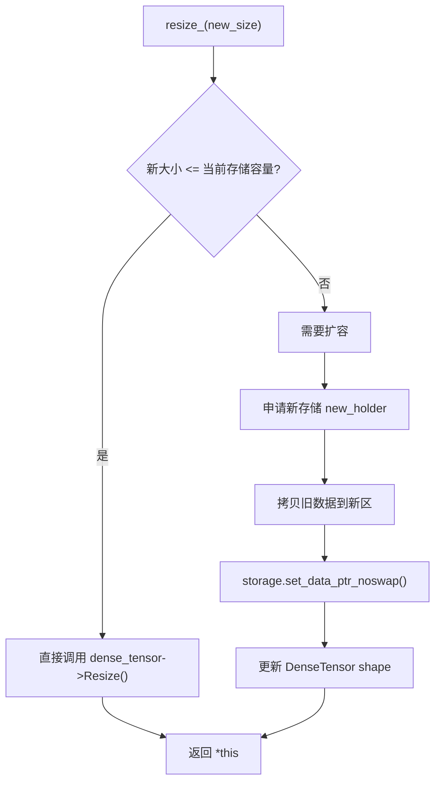
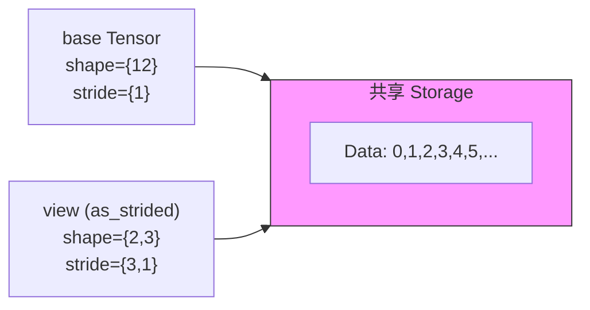

# resize_ 与 as_strided 算子学习文档

本文档结合具体代码，一步步讲解 Paddle compat 层中 `resize_` 和 `as_strided` 算子的实现原理与使用方法。

> **Note**: 本文档参考 `/home/may/Paddle/paddle/phi/api/include/compat/ATen/ops/resize.h` 和 `/home/may/Paddle/paddle/phi/api/include/compat/ATen/ops/as_strided.h` 源码以及对应测试文件编写。

---

## 1. resize_ 算子

`resize_` 是一个原地（in-place）算子，用于改变张量的形状（shape），同时尽可能保留存储（storage）语义和数据。

### 1.1 核心实现解析

```cpp
// paddle/phi/api/include/compat/ATen/ops/resize.h (lines 71-117)

// resize_ - operate on the underlying DenseTensor directly so we preserve
// storage semantics across shrink/grow round-trips. When growth exceeds the
// current capacity, expand the shared storage itself so aliasing views keep
// their storage offset and existing storage contents stay intact.
inline const at::Tensor& Tensor::resize_(
    at::IntArrayRef size,
    ::std::optional<at::MemoryFormat> memory_format) const {
  // Keep old compat behavior for memory_format in this split PR.
  // TODO(youge325): add real ChannelsLast/ChannelsLast3d restride support later.
  (void)memory_format;

  std::vector<int64_t> dims(size.begin(), size.end());
  int64_t new_numel = detail::ResizeCheckedNumel(size);
  auto dense_tensor =
      std::dynamic_pointer_cast<phi::DenseTensor>(tensor_.impl());
  TORCH_CHECK(dense_tensor != nullptr,
              "resize_ only supports DenseTensor, but got a non-dense tensor");
  TORCH_CHECK(tensor_.defined(),
              "resize_ is not allowed on an undefined tensor");

  const size_t itemsize = phi::SizeOf(dense_tensor->dtype());
  const size_t new_storage_bytes = detail::ResizeCheckedStorageBytes(
      new_numel, itemsize, dense_tensor->meta().offset);
  const size_t current_storage_bytes =
      dense_tensor->Holder() == nullptr ? 0 : dense_tensor->Holder()->size();

  // 情况1：新大小 <= 当前存储容量，直接调整 meta
  if (new_storage_bytes <= current_storage_bytes || new_numel == 0) {
    dense_tensor->Resize(dims);
    return *this;
  }

  // 情况2：需要扩容 - 通过 compat Storage 路径同步，确保 holder 是 StorageHolderView
  auto storage = this->storage();
  const auto old_holder = dense_tensor->Holder();
  TORCH_CHECK(old_holder != nullptr,
              "resize_ cannot grow a tensor without allocated storage");
  const phi::Place place = old_holder->place();
  auto new_holder = paddle::memory::AllocShared(place, new_storage_bytes);
  TORCH_CHECK(new_holder != nullptr, "resize_ failed to allocate storage");
  const size_t copy_bytes = std::min(old_holder->size(), new_storage_bytes);
  if (copy_bytes > 0 && old_holder->ptr() != nullptr &&
      old_holder->ptr() != new_holder->ptr()) {
    phi::memory_utils::Copy(
        place, new_holder->ptr(), place, old_holder->ptr(), copy_bytes);
  }
  storage.set_data_ptr_noswap(std::move(new_holder));
  dense_tensor->Resize(phi::make_ddim(dims));
  return *this;
}
```

### 1.2 关键设计点



| 场景 | 处理方式 | 存储是否变化 |
|------|----------|--------------|
| **缩小** (shrink) | 只修改 shape meta | 不变 |
| **同大小** | 无实际操作 | 不变 |
| **放大但容量够** | 只修改 shape meta | 不变 |
| **放大需扩容** | 申请新存储 + 数据拷贝 | 变化 |

### 1.3 辅助函数详解

```cpp
// paddle/phi/api/include/compat/ATen/ops/resize.h (lines 33-63)

namespace detail {

// 计算新的元素数量，带溢出检查
inline int64_t ResizeCheckedNumel(at::IntArrayRef size) {
  int64_t numel = 1;
  for (const auto dim : size) {
    TORCH_CHECK(dim >= 0,
                "Trying to create tensor with negative dimension ",
                dim,
                ": ",
                size);
    if (dim == 0) {
      numel = 0;
      continue;
    }
    TORCH_CHECK(numel <= std::numeric_limits<int64_t>::max() / dim,
                "resize_ size is too large, possible overflow for size ",
                size);
    numel *= dim;
  }
  return numel;
}

// 计算所需存储字节数，带溢出检查
inline size_t ResizeCheckedStorageBytes(int64_t numel,
                                        size_t itemsize,
                                        size_t storage_offset_bytes) {
  const auto numel_size = static_cast<size_t>(numel);
  TORCH_CHECK(
      itemsize == 0 || numel_size <= (std::numeric_limits<size_t>::max() -
                                      storage_offset_bytes) /
                                         itemsize,
      "resize_ size is too large in bytes");
  return storage_offset_bytes + numel_size * itemsize;
}

}  // namespace detail
```

---

## 2. as_strided 算子

`as_strided` 创建一个具有指定形状（size）、步幅（stride）和存储偏移（storage_offset）的张量视图（view），与原始张量共享底层存储。

### 2.1 核心实现解析

```cpp
// paddle/phi/api/include/compat/ATen/ops/as_strided.h (lines 28-66)

// as_strided: Create a tensor view with custom size, stride, and storage_offset
inline at::Tensor Tensor::as_strided(
    at::IntArrayRef size,
    at::IntArrayRef stride,
    ::std::optional<int64_t> storage_offset) const {
  // Materialize the compat StorageHolderView before creating the view so
  // aliasing tensors share one StorageImpl and observe later resize_ growth.
  (void)this->storage();
  auto src_impl = tensor_.impl();
  auto* src_tensor =
      std::dynamic_pointer_cast<phi::DenseTensor>(src_impl).get();
  if (!src_tensor) {
    PD_THROW("as_strided: tensor must be a DenseTensor");
  }
  
  // 创建新的 shape 和 stride
  std::vector<int64_t> size_vec(size.begin(), size.end());
  std::vector<int64_t> stride_vec(stride.begin(), stride.end());

  // 创建新的 DenseTensor 对象
  auto new_tensor = std::make_shared<phi::DenseTensor>();

  // 共享底层数据（复制 src meta，后续覆盖）
  new_tensor->ShareDataWith(*src_tensor);

  // 创建新的 meta，包含新的 shape、stride 和 offset
  phi::DenseTensorMeta meta(src_tensor->dtype(),
                            common::make_ddim(size_vec),
                            common::make_ddim(stride_vec));
  // 计算字节偏移
  int64_t offset = storage_offset.has_value() ? storage_offset.value() : 0;
  meta.offset = src_tensor->meta().offset +
                static_cast<size_t>(offset) * phi::SizeOf(src_tensor->dtype());
  new_tensor->set_meta(meta);
  
  PaddleTensor result;
  result.set_impl(new_tensor);
  return Tensor(result);
}
```

### 2.2 as_strided_ - 原地版本

```cpp
// paddle/phi/api/include/compat/ATen/ops/as_strided.h (lines 69-94)

// as_strided_: Inplace version
inline const at::Tensor& Tensor::as_strided_(
    at::IntArrayRef size,
    at::IntArrayRef stride,
    ::std::optional<int64_t> storage_offset) const {
  // Keep inplace metadata-only view rewrites attached to the same compat
  // storage as the original tensor.
  (void)this->storage();
  auto src_impl = tensor_.impl();
  auto* src_tensor =
      std::dynamic_pointer_cast<phi::DenseTensor>(src_impl).get();
  if (!src_tensor) {
    PD_THROW("as_strided_: tensor must be a DenseTensor");
  }
  std::vector<int64_t> size_vec(size.begin(), size.end());
  std::vector<int64_t> stride_vec(stride.begin(), stride.end());
  
  // 使用 set_meta 而不是 Resize + set_strides，避免连续性检查
  phi::DenseTensorMeta meta(src_tensor->dtype(),
                            common::make_ddim(size_vec),
                            common::make_ddim(stride_vec));
  meta.layout = src_tensor->layout();
  int64_t offset = storage_offset.has_value() ? storage_offset.value() : 0;
  meta.offset = src_tensor->meta().offset +
                static_cast<size_t>(offset) * phi::SizeOf(src_tensor->dtype());
  src_tensor->set_meta(meta);  // 直接修改原 tensor 的 meta
  return *this;
}
```

### 2.3 as_strided_scatter - 散射版本

```cpp
// paddle/phi/api/include/compat/ATen/ops/as_strided.h (lines 97-111)

// as_strided_scatter: Scatter src into a strided view
// Returns a new tensor (copy of self) with the strided window filled by src.
// The original tensor is NOT modified.
inline at::Tensor Tensor::as_strided_scatter(
    const at::Tensor& src,
    at::IntArrayRef size,
    at::IntArrayRef stride,
    ::std::optional<int64_t> storage_offset) const {
  // Clone self to an independent copy so the original tensor is left unchanged
  PaddleTensor self_copy = tensor_.copy_to(tensor_.place(), /*blocking=*/true);
  at::Tensor copy_tensor(self_copy);
  at::Tensor strided_view =
      copy_tensor.as_strided(size, stride, storage_offset);
  strided_view.copy_(src);
  return strided_view;
}
```

### 2.4 内存布局示意

```
原始数据: [0, 1, 2, 3, 4, 5, 6, 7, 8, 9, 10, 11]

as_strided({2, 3}, {3, 1}, 0) 创建视图:
  逻辑形状: 2x3
  stride: [3, 1] 表示第0维每步跳过3个元素，第1维每步跳过1个
  
  结果:
  [[0, 1, 2],
   [3, 4, 5]]

as_strided({2, 3}, {3, 1}, 2) 带偏移创建视图:
  从索引2开始
  
  结果:
  [[2, 3, 4],
   [5, 6, 7]]
```

---

## 3. 测试代码解读

### 3.1 resize_ 基础测试

```cpp
// test/cpp/compat/ATen_resize_test.cc (lines 35-45)

TEST(TensorResizeTest, ResizeBasic) {
  // Create a 2x3 tensor
  at::Tensor t = at::arange(6, at::kFloat).reshape({2, 3});

  // Resize to 3x2 (same 6 elements)
  t.resize_({3, 2});

  // Verify the shape
  ASSERT_EQ(t.sizes()[0], 3);
  ASSERT_EQ(t.sizes()[1], 2);
}
```

### 3.2 resize_ 数据保留测试

```cpp
// test/cpp/compat/ATen_resize_test.cc (lines 100-115)

TEST(TensorResizeTest, ResizePreservesData) {
  // Create tensor with known values
  at::Tensor t = at::arange(6, at::kFloat).reshape({2, 3});

  // Resize to 3x2
  t.resize_({3, 2});

  // Verify data is preserved (in row-major order)
  float* data = t.data_ptr<float>();
  ASSERT_FLOAT_EQ(data[0], 0.0f);
  ASSERT_FLOAT_EQ(data[1], 1.0f);
  ASSERT_FLOAT_EQ(data[2], 2.0f);
  ASSERT_FLOAT_EQ(data[3], 3.0f);
  ASSERT_FLOAT_EQ(data[4], 4.0f);
  ASSERT_FLOAT_EQ(data[5], 5.0f);
}
```

### 3.3 resize_ 缩小与放大测试

```cpp
// test/cpp/compat/ATen_resize_test.cc (lines 117-143)

TEST(TensorResizeTest, ResizeShrinkDifferentNumel) {
  at::Tensor t = at::arange(24, at::kFloat).reshape({2, 3, 4});

  t.resize_({4, 5});  // 从 24 缩小到 20

  ASSERT_EQ(t.sizes()[0], 4);
  ASSERT_EQ(t.sizes()[1], 5);

  float* data = t.data_ptr<float>();
  for (int i = 0; i < 20; ++i) {
    ASSERT_FLOAT_EQ(data[i], static_cast<float>(i));  // 前20个数据保留
  }
}

TEST(TensorResizeTest, ResizeGrowDifferentNumelPreservesPrefix) {
  at::Tensor t = at::arange(6, at::kFloat).reshape({2, 3});

  t.resize_({2, 5});  // 从 6 放大到 10

  ASSERT_EQ(t.sizes()[0], 2);
  ASSERT_EQ(t.sizes()[1], 5);

  float* data = t.data_ptr<float>();
  for (int i = 0; i < 6; ++i) {
    ASSERT_FLOAT_EQ(data[i], static_cast<float>(i));  // 原有6个数据保留
  }
}
```

### 3.4 resize_ 与 view 共享存储测试

```cpp
// test/cpp/compat/ATen_resize_test.cc (lines 264-288)

TEST(TensorResizeTest, ResizeSliceSharedStorageCopiesFromStorageStart) {
  // ta = [1, 2, 3, 4], tb = [2, 3, 4]
  // Build tb through as_strided so it is a view with a non-zero storage
  // offset even when backend slice kernels materialize copies.
  at::Tensor ta = at::tensor({1, 2, 3, 4}, at::kInt);
  at::Tensor tb = ta.as_strided({3}, {1}, 1);

  tb.resize_(4);

  // After resize, tb[0] and ta[1] must point to the exact same address.
  ASSERT_EQ(tb.data_ptr<int>(), ta.data_ptr<int>() + 1);

  // The original storage contents should remain unchanged.
  ASSERT_EQ(ta[0].item<int>(), 1);
  ASSERT_EQ(ta[1].item<int>(), 2);
  ASSERT_EQ(ta[2].item<int>(), 3);
  ASSERT_EQ(ta[3].item<int>(), 4);

  // PyTorch only preserves the pre-existing prefix here.
  ASSERT_EQ(tb[0].item<int>(), 2);
  ASSERT_EQ(tb[1].item<int>(), 3);
  ASSERT_EQ(tb[2].item<int>(), 4);
  ASSERT_EQ(tb.numel(), 4);
}
```

### 3.5 as_strided 基础测试

```cpp
// test/cpp/compat/ATen_as_strided_test.cc (lines 34-44)

TEST_F(TensorAsStridedTest, AsStridedBasic) {
  // shape {2,3}, stride {3,1}: [[0,1,2],[3,4,5]]
  at::Tensor t = at::arange(12, at::kFloat);
  at::Tensor result = t.as_strided({2, 3}, {3, 1});

  ASSERT_EQ(result.sizes(), c10::IntArrayRef({2, 3}));
  float* data = result.data_ptr<float>();
  ASSERT_FLOAT_EQ(data[0], 0.0f);
  ASSERT_FLOAT_EQ(data[1], 1.0f);
  ASSERT_FLOAT_EQ(data[5], 5.0f);
}
```

### 3.6 as_strided 带偏移测试

```cpp
// test/cpp/compat/ATen_as_strided_test.cc (lines 46-54)

TEST_F(TensorAsStridedTest, AsStridedWithOffset) {
  // offset=2: [[2,3,4],[5,6,7]]
  at::Tensor t = at::arange(12, at::kFloat);
  at::Tensor result = t.as_strided({2, 3}, {3, 1}, 2);

  ASSERT_EQ(result.sizes(), c10::IntArrayRef({2, 3}));
  float* data = result.data_ptr<float>();
  ASSERT_FLOAT_EQ(data[5], 7.0f);
}
```

### 3.7 as_strided_ 原地修改测试

```cpp
// test/cpp/compat/ATen_as_strided_test.cc (lines 67-80)

TEST_F(TensorAsStridedTest, AsStridedInplace) {
  // inplace: shape {12} -> {2,6}
  at::Tensor t = at::arange(12, at::kFloat);
  float* original_data_ptr = t.data_ptr<float>();

  t.as_strided_({2, 6}, {6, 1});

  ASSERT_EQ(t.sizes(), c10::IntArrayRef({2, 6}));
  ASSERT_EQ(t.data_ptr<float>(), original_data_ptr);  // 数据指针不变

  float* data = t.data_ptr<float>();
  ASSERT_FLOAT_EQ(data[0], 0.0f);
  ASSERT_FLOAT_EQ(data[11], 11.0f);
}
```

### 3.8 as_strided_scatter 测试

```cpp
// test/cpp/compat/ATen_as_strided_test.cc (lines 106-117)

TEST_F(TensorAsStridedTest, AsStridedScatterBasic) {
  // Scatter 2x3 99s into t: [[99,99,99],[99,99,99],...]]
  at::Tensor t = at::arange(12, at::kFloat);
  at::Tensor src = at::full({2, 3}, 99.0f, at::kFloat);
  at::Tensor result = t.as_strided_scatter(src, {2, 3}, {3, 1});

  ASSERT_EQ(result.sizes(), c10::IntArrayRef({2, 3}));
  float* data = result.data_ptr<float>();
  for (int i = 0; i < 6; ++i) {
    ASSERT_FLOAT_EQ(data[i], 99.0f);
  }
}

TEST_F(TensorAsStridedTest, AsStridedScatterOriginalUnchanged) {
  // Scatter returns new tensor, original unchanged
  at::Tensor t = at::arange(12, at::kFloat);
  at::Tensor src = at::full({2, 3}, 99.0f, at::kFloat);
  at::Tensor result = t.as_strided_scatter(src, {2, 3}, {3, 1});

  ASSERT_FLOAT_EQ(t.data_ptr<float>()[0], 0.0f);  // 原 tensor 不变
}
```

### 3.9 as_strided 转置效果测试

```cpp
// test/cpp/compat/ATen_as_strided_test.cc (lines 140-153)

TEST_F(TensorAsStridedTest, AsStridedTranspose) {
  if (!FLAGS_use_stride_kernel) {
    return;
  }
  // Transpose: shape {2,3} -> {3,2}, stride {1,2}
  // [[0,1,2],[3,4,5]] -> [[0,3],[1,4],[2,5]]
  at::Tensor t = at::arange(6, at::kFloat).view({2, 3});
  at::Tensor result = t.as_strided({3, 2}, {1, 2});

  ASSERT_EQ(result.sizes(), c10::IntArrayRef({3, 2}));
  float* data = result.data_ptr<float>();
  ASSERT_FLOAT_EQ(data[0], 0.0f);
  ASSERT_FLOAT_EQ(data[5], 5.0f);
}
```

---

## 4. resize_ 与 as_strided 的协作

这两个算子经常一起使用，特别是在处理视图（view）和存储（storage）关系时。

### 4.1 典型使用场景

```cpp
// 创建基础张量
at::Tensor base = at::arange(12, at::kFloat);  // [0, 1, 2, ..., 11]

// 创建视图（共享存储）
at::Tensor view = base.as_strided({2, 3}, {3, 1});  // [[0,1,2],[3,4,5]]

// 调整视图大小（会触发存储扩容）
view.resize_({2, 5});  // 存储从 12 扩容到 12+ (足够容纳 10 个元素)

// 此时 base 和 view 的数据指针关系取决于具体实现
```

### 4.2 存储共享关系



---

## 5. API 使用示例

### 5.1 resize_ 使用示例

```cpp
#include <ATen/Functions.h>
#include <ATen/ops/resize.h>

// 基本 resize
at::Tensor t = at::arange(6, at::kFloat).reshape({2, 3});
t.resize_({3, 2});  // 形状变为 3x2

// 缩小
at::Tensor t2 = at::arange(24, at::kFloat).reshape({2, 3, 4});
t2.resize_({4, 5});  // 从 24 个元素缩小到 20 个

// 放大（触发存储重新分配）
at::Tensor t3 = at::arange(6, at::kFloat);
t3.resize_({2, 5});  // 从 6 个元素放大到 10 个

// 使用 memory_format（当前版本保留但暂不完全支持 ChannelsLast）
t.resize_({1, 3, 2, 4}, at::MemoryFormat::ChannelsLast);
```

### 5.2 as_strided 使用示例

```cpp
#include <ATen/Functions.h>
#include <ATen/ops/as_strided.h>

// 基本 as_strided
at::Tensor t = at::arange(12, at::kFloat);
at::Tensor view = t.as_strided({2, 3}, {3, 1});

// 带偏移的 as_strided
at::Tensor view2 = t.as_strided({2, 3}, {3, 1}, 2);

// 原地 as_strided_
at::Tensor t2 = at::arange(12, at::kFloat);
t2.as_strided_({2, 6}, {6, 1});  // 修改 t2 本身

// 使用 as_strided_scatter
at::Tensor base = at::arange(12, at::kFloat);
at::Tensor src = at::full({2, 3}, 99.0f, at::kFloat);
at::Tensor result = base.as_strided_scatter(src, {2, 3}, {3, 1});
```

---

## 6. 注意事项

1. **resize_ 可能重新分配存储**：当目标大小超过当前存储容量时，`resize_` 会申请新的存储，这会导致与原始张量的共享关系断开。

2. **as_strided 创建的是视图**：`as_strided` 返回的张量与原始张量共享底层数据，修改一个会影响另一个。

3. **storage_offset 的单位是元素个数**：在 PyTorch 兼容 API 中，`storage_offset` 以元素为单位，但在内部会转换为字节偏移。

4. **内存安全检查**：`resize_` 包含溢出检查（`ResizeCheckedNumel` 和 `ResizeCheckedStorageBytes`），防止恶意或错误的尺寸参数导致问题。

5. **ChannelsLast 支持**：当前版本的 `resize_` 接受 `MemoryFormat` 参数但仅保留兼容性，完整的 ChannelsLast/ChannelsLast3d 支持在 TODO 中。

---

## 7. 参考代码路径

| 文件 | 说明 |
|------|------|
| `/home/may/Paddle/paddle/phi/api/include/compat/ATen/ops/resize.h` | resize_ 算子实现 |
| `/home/may/Paddle/paddle/phi/api/include/compat/ATen/ops/as_strided.h` | as_strided 算子实现 |
| `/home/may/Paddle/test/cpp/compat/ATen_resize_test.cc` | resize_ 完整测试 |
| `/home/may/Paddle/test/cpp/compat/ATen_as_strided_test.cc` | as_strided 完整测试 |
| `/home/may/Paddle/test/cpp/compat/ATen_basic_test.cc` | 基础 API 测试（含 view 相关） |
